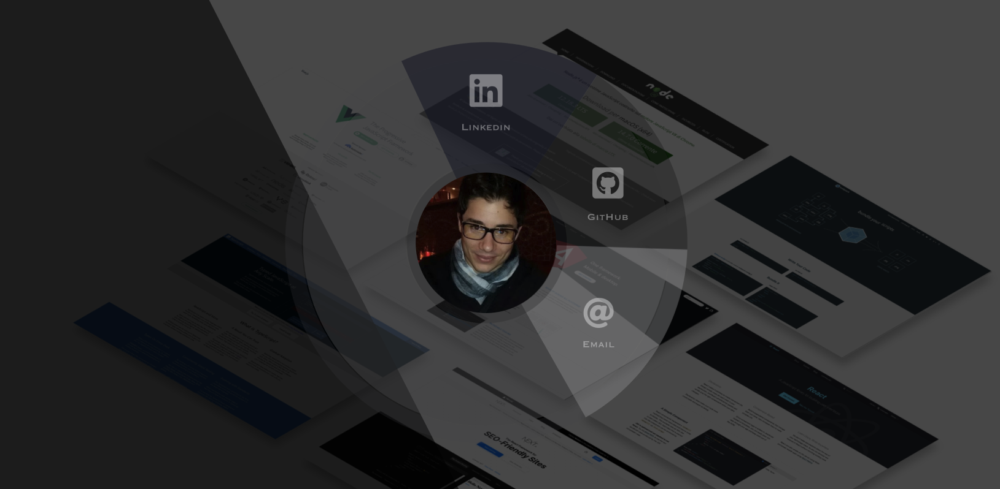

# RESPONSIVE WEB DESIGN PROJECT | PERSONAL PORTFOLIO WEBPAGE

> This is the fifth project of _freeCodeCamp "RESPONSIVE WEB DESIGN" Certification_

## SUMMARY

The goal of the project is fulfill the below user stories to pass and get all of the tests using only **HTML**, **JavaScript**, and plain **CSS**. 
The main topics covered are:
- HTML and HTML5
- CSS and CSS3
- Applied Visual Design
- Applied Accessibility
- Responsive Web Design Principles
- CSS Flexbox
- CSS Grid

### User Stories
| US | Description |
| :------------ | :----------- |
| **#1**: | My portfolio should have a welcome section with an id of `welcome-section`. |
| **#2**: | The welcome section should have an `h1` element that contains text. |
| **#3**: | My portfolio should have a projects section with an id of `projects`. |
| **#4**: | The projects section should contain at least one element with a class of `project-tile` to hold a project. |
| **#5**: | The projects section should contain at least one link to a project. |
| **#6**: | My portfolio should have a navbar with an id of `navbar`. |
| **#7**: | The navbar should contain at least one link that I can click on to navigate to different sections of the page. |
| **#8**: | My portfolio should have a link with an id of `profile-link`, which opens my GitHub or FCC profile in a new tab. |
| **#9**: | My portfolio should have at least one media query. |
| **#10**: | The height of the welcome section should be equal to the height of the viewport. |
| **#11**: | The navbar should always be at the top of the viewport. |
